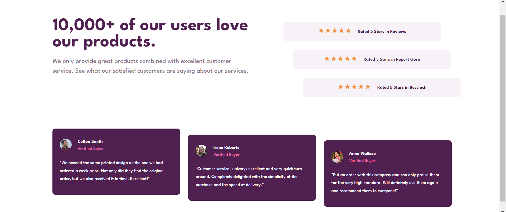

# Frontend Mentor - Social proof section solution

This is a solution to the [Social proof section challenge on Frontend Mentor](https://www.frontendmentor.io/challenges/social-proof-section-6e0qTv_bA). Frontend Mentor challenges help you improve your coding skills by building realistic projects. 

## Table of contents

- [Overview](#overview)
  - [The challenge](#the-challenge)
  - [Screenshot](#screenshot)
  - [Links](#links)
- [My process](#my-process)
  - [Built with](#built-with)
  - [What I learned](#what-i-learned)
  - [Continued development](#continued-development)
  - [Useful resources](#useful-resources)
- [Author](#author)
- [Acknowledgments](#acknowledgments)

**Note: Delete this note and update the table of contents based on what sections you keep.**

## Overview

### The challenge

Users should be able to:

- View the optimal layout for the section depending on their device's screen size

### Screenshot

### Links

- Solution URL: [Add solution URL here](https://your-solution-url.com)
- Live Site URL: [Add live site URL here](https://whunter413.github.io/Social-proof-section/)

## My process
Mobile first workflow starting with sculpting the page out into sections and applying overall styles and then working top to bottom.

### Built with

- Semantic HTML5 markup
- CSS custom properties
- Flexbox
- Mobile-first workflow!!

### What I learned

Had a lot of fun creating this responsive project. Learned a lot about making sure that div widths are matching for different semantic sections so that everything lines up right. 

## Author

- Frontend Mentor - [@whunter413](https://www.frontendmentor.io/profile/whunter413)

## Acknowledgments

Thank you to Ann for pointing out that my body div had some margin applied to it, thats why that stupid slide bar was there. 
